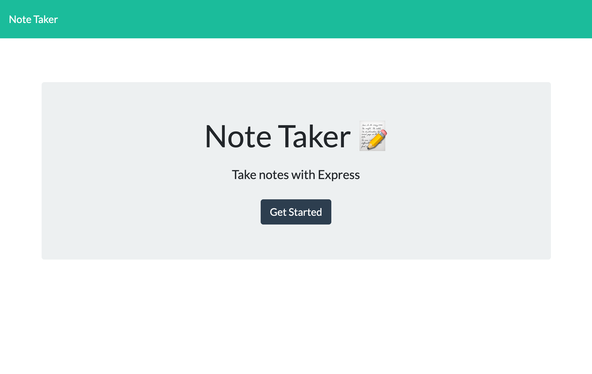
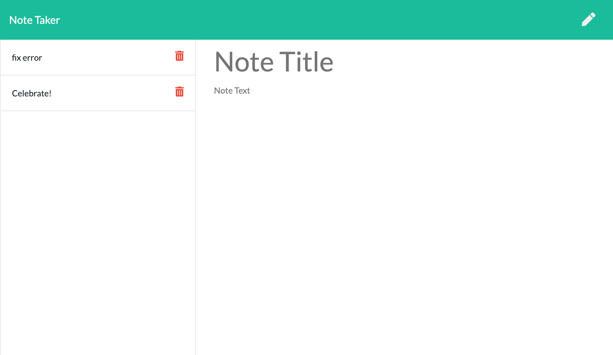
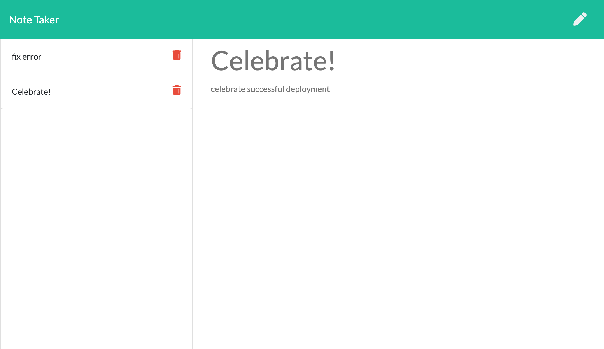

# Note Taker App

A Note taking app build using Node.js and express.js for the purposes of writing down and saving notes. 

## User Story

AS A small business owner
I WANT to be able to write and save notes
SO THAT I can organize my thoughts and keep track of tasks I need to complete

## Description

This application allows the user to input notes as well as a title for each note and save them. Saved notes appear in the left hand sidebar and if clicked on will be displayed in the main note section. Unwanted notes can also be deleted with the provided delete button. 
This app made use of Node.js, Express.js and javascript to create the front and backend of the application. It has been deployed using [Heroku](https://note-taker-basic.herokuapp.com/) .

## Table of Contents

* [Installation](#installation)
* [Usage](#usage)
* [Contributing Guidelines](#contributing)
* [License](#license)
* [Questions](#questions)

## Installation
 
 To run the app from your local machine, you must download all files and initial;ize the PORT from within the app folder using 'npm start' in the command line. Once PORT has been initialized, app can be opened in browser by navigating to 'localhost:3001'. 
 For an easier method of accessing the app, use the heroku link.

## Usage 

On opening the app, the user will be presented with a landing page with a button to 'get started'. On clicking the button, the user will be taken to the notes app where user can enter a note with a title and save it. Saved notes will be displayed in the left-hand sidebar and on clicking a note in the sidebar, it will be displayed in the main notes section. Clicking the pencil icon in the tp right hand corner will clear all input fields so new notes can be entered. If a note in no longer needed, it can be deleted using the delete icon next to each note in the sidebar.

## Contributing
 
 Link to Contributor's Covenant:[Contributors Covenant](https://www.contributor-covenant.org/version/2/0/code_of_conduct/) 

 
## License

   
Copyright (c) [2021] [Nida Ghuman]

Permission is hereby granted, free of charge, to any person obtaining a copy
of this software and associated documentation files (the "Software"), to deal
in the Software without restriction, including without limitation the rights
to use, copy, modify, merge, publish, distribute, sublicense, and/or sell
copies of the Software, and to permit persons to whom the Software is
furnished to do so, subject to the following conditions:

The above copyright notice and this permission notice shall be included in all
copies or substantial portions of the Software.

THE SOFTWARE IS PROVIDED "AS IS", WITHOUT WARRANTY OF ANY KIND, EXPRESS OR
IMPLIED, INCLUDING BUT NOT LIMITED TO THE WARRANTIES OF MERCHANTABILITY,
FITNESS FOR A PARTICULAR PURPOSE AND NONINFRINGEMENT. IN NO EVENT SHALL THE
AUTHORS OR COPYRIGHT HOLDERS BE LIABLE FOR ANY CLAIM, DAMAGES OR OTHER
LIABILITY, WHETHER IN AN ACTION OF CONTRACT, TORT OR OTHERWISE, ARISING FROM,
OUT OF OR IN CONNECTION WITH THE SOFTWARE OR THE USE OR OTHER DEALINGS IN THE
SOFTWARE. 

## Questions

The repo for this project can be found here: https://github.com/nidaqg/note-taker

Heroku link : https://note-taker-basic.herokuapp.com/

For any questions or to report issues, email me at: nidaqg@gmail.com
